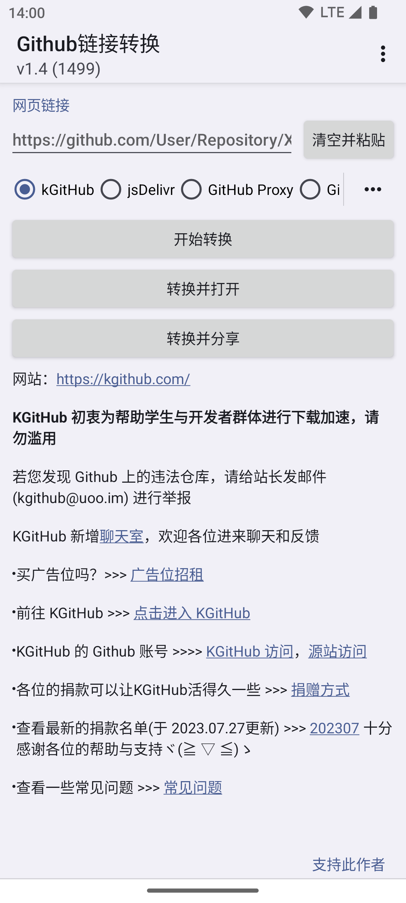
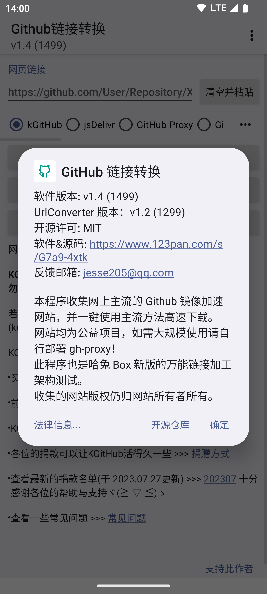
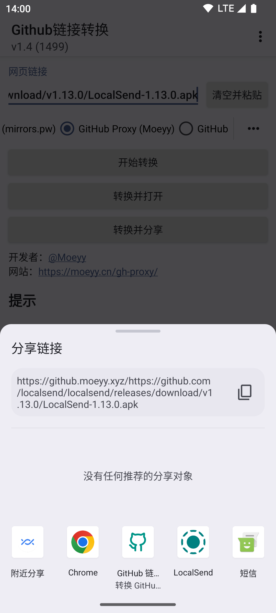

# GitHub Link Converter

Convert GitHub Links, High Speed Download.

This project is written in Lua language and is also an example of the universal converter for Hello Tool (not yet available).

## Screenshot

## Installation Tutorial

1. Go to [Gitee Distribution](https://gitee.com/Jesse205/GitHubUrlConverter/releases/latest) and download the pre-compiled installer, the file name usually ends with `.apk`.
    - You can also go to [123 pan](https://www.123pan.com/s/G7a9-4xtk.html) to download, but the update may not be timely.
    - You can also go to [Baidu Netdisk](https://pan.baidu.com/s/1DUh2ecgyxTRNoJ5bm30fdg?pwd=qqi7) (password: qqi7) to download, but the update may not be timely.
2. Follow the tutorials in [Flashing Guide - Installing Software (Chinese)](https://jesse205.github.io/FlashAndroidDevicesGuidelines/normal/installApk/) to install the utility.

## Instructions for use

1. Fill in the input box with the link to the GitHub file (e.g. the distribution).
    - You can copy the GitHub link and paste it into the input box.
    - You can also share the link to this app directly from the GitHub APP. Works best with the F-Droid App Store.
    - It should be noted that higher versions of Android have url checksums, so you may not be able to open this app with an open browser on higher versions of Android at the moment.
2. Processing links (converting links).
    - Click "Start Conversion", then copy the link to your browser or share it with your friends.
    - Or click "Convert and Open" to open the link with your browser.
    - Or click "Convert and Share" to share the link with your friends.

> **Note**\
> The text in the input box will automatically match the link, so you don't need to worry about impurities outside the link.

For more information, please read the [Document](./docs/README.md) (Chinese).

## Contribute

1. Fork this repository
2. Create a new Feat_xxx branch.
3. Commit code
4. Create a new Pull Request
